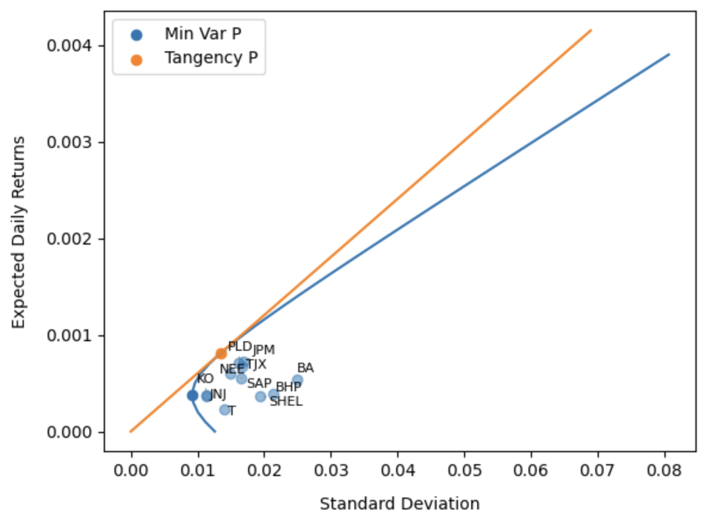
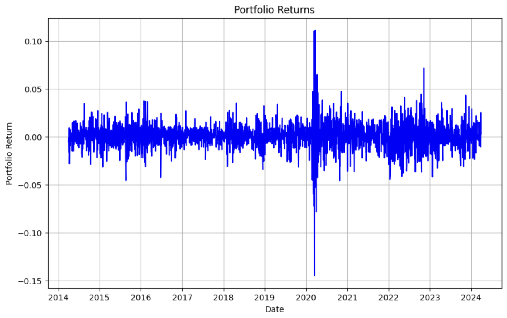
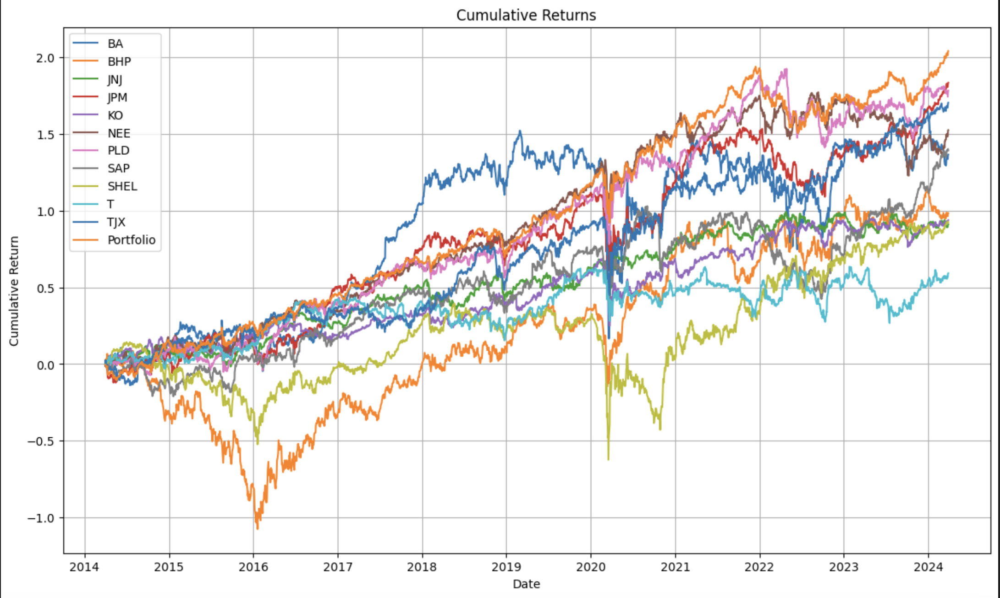

# Portfolio_Risk_VaR_and_ES

### Intro
This analysis focuses on the risk assessment of a diversified stock portfolio using two prominent risk metrics: Value at Risk (VaR) and Expected Shortfall (ES). VaR is a widely used risk measure that estimates the maximum potential loss of a portfolio over a specified time period within a given confidence level. While VaR provides a clear threshold for potential losses, it does not capture the extent of losses beyond this threshold. To address this limitation, Expected Shortfall (ES), also known as Conditional VaR, is employed. ES provides an average of the potential losses exceeding the VaR, offering a more comprehensive view of tail risk.

### Portfolio Creation
I arbitrarily selected 11 stocks, one from each of the 11 GICS sectors outlined by [MSCI](https://www.msci.com/our-solutions/indexes/gics), and got daily adjested close prices for the last 10 years from 01/04/2014 to 28/04/2024. Then I calculated the efficent frontier for these stocks and used the weights of the optimal portfolio to get daily returns for the portfolio. Two assumptions I made are that short selling is allowed, hence negative weights and for simplicity the risk free rate is 0. The images show the efficient frontier, portfolio returns, the cumulative returns of each stock and the portfolio and how the returns are distributed respectively.

| Stock  | Weight |
|----------|----------|
| BA  | -13.98%  |
| BHP  | -8.7%  |
| JNJ  | 12.79%  |
| JPM  | 46.04%  |
| KO  | -1.65%  |
| NEE  | 33.28%  |
| PLD  | 24.72%  |
| SAP  | 13.01%  |
| SHEL  | -5.75%  |
| T  | -26.22%  |
| TJX  | 26.48%  |

  
  
  
  

### Risk Calculations

These methods were used to calculate 1% 1-day VaR for a $1000 fortfolio value:

- Historic Simulation
- VaR assuming normal distribution
- VaR assuming t-distribution
- Age Weighted VaR
- Modified VaR

Results can be intemperated as we are 99% certain losses will not exceed {Insert VaR Value} in one day.

|            | **Historic Simulation** | **Normal Dist.** | **T-Dist.** | **Age Weighted** | **Modified** |
|:------------:|:------------:|:------------:|:------------:|:------------:|:------------:|
| **1% 1-Day VaR** | $35.54  | $31.35  | $36.55  | $25.52  | $78.68  |

For the expected shortfall I only looked at 3 methods:

- Historic Simulation
- VaR assuming normal distribution
- VaR assuming t-distribution

These results can be intemperated as if the loss exceeds the {Insert VaR Value} threshold, the average loss will be {Insert ES Value}.

|            | **Historic Simulation** | **Normal Dist.** | **T-Dist.** |
|:------------:|:------------:|:------------:|:------------:|
| **ES** | $48.41  | $35.92  | $116.26  |

